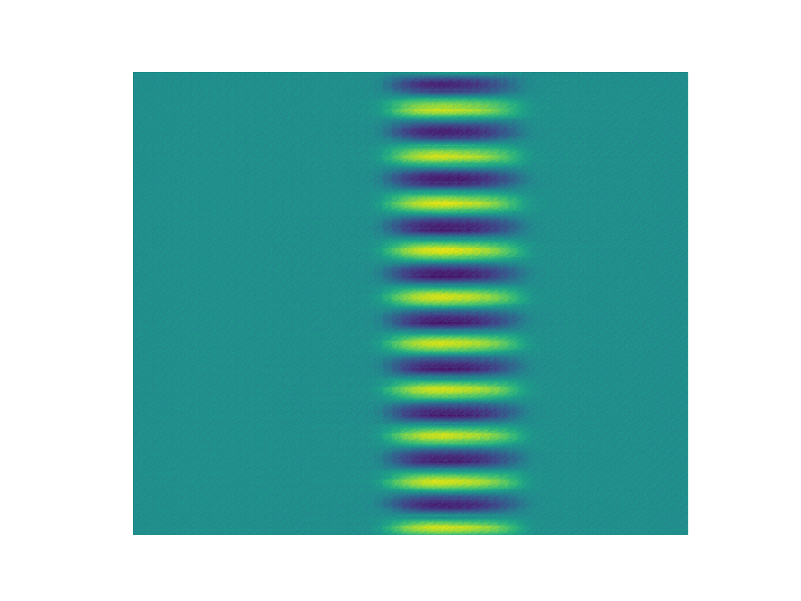

## Scalable Diffusion Models with Transformers (DiT)<br><sub>Official PyTorch Implementation</sub>




This repo contains PyTorch model definitions, pre-trained weights and training/sampling code for our model exploring Fiber Optic Sensing with DiT.

Check this [website](https://aragonphotonics.com/technology/) for detailed problem which we are trying to solve through our model.

Special thanks to [DiT](https://github.com/facebookresearch/DiT), which is used as backbone of our model.


## Changes

1. We choose to use DiT-S/8, because it has the least number of parameters, and our task is rather simple compared to generating a beatuful image.
2. We did not choose to have a latent space, and the reason is the same as point 1. As a result, we also do not need an autoencoder.
3. Since we treat the target to-be-denoised image as a condition in the diffusion process, we simply concat the patified image with gaussian noise, and throw it into DiT.
4. We train a model that takes as input an 400\*480\*1 image, but we support arbitrary shape of images to denoise. Specifically, we cut and pad input images into several 400\*480 images, then feed them into our model.
5. We do not use classifier-free guidance, since our model just perfroms great without CFG.
6. Additionally, we have made a small modification to `patch_embed.py` within module `timm`. We have put our modified version of `patch_embed.py` in our repo, and now you can replace the original one with ours!


## Setup

First, download and set up the repo:

```bash
git clone https://github.com/madeline-past/DiT.git
cd DiT
```

We provide an [`environment.yml`](environment.yml) file that can be used to create a Conda environment. If you only want 
to run pre-trained models locally on CPU, you can remove the `cudatoolkit` and `pytorch-cuda` requirements from the file.

```bash
conda env create -f environment.yml
conda activate DiT
```


## Sampling 

**Pre-trained DiT checkpoints.** You can denoise arbitrary image from our pre-trained DiT models with [`sample.py`](sample.py). Weights for our pre-trained DiT model can be downloaded in [releases](https://github.com/madeline-past/DiT/releases/tag/v1.0.0). For example, to sample from
our model, you can use:

```bash
python sample.py --seed 1 --model DiT-S/8 --ckpt /path/to/ckpt
```


## Acknowledgments
We greatly appreciate authors of DiT and their open source spirit.

## License
The code and model weights are licensed under CC-BY-NC. See [`LICENSE.txt`](LICENSE.txt) for details.
